# 2021_Spring_finals

# Final Project - IS 597PR
# Terrorism in the world throughout the years

Overview: 
Terrorism is a disease which has been stuck with us forever. Our project aims to analyse terrorist activities which have been carried out throughout the world since 1970 till 2017. 
We plan to do this by analysing the datasets which will give us a deep insight into how and where the terrorist activities were carried out through these years. We decided to come up with hypothesis centered around population, income, citizenship status, type of people that were targeted and age group of terrorists. 
The data that we worked on is open source data found on Kaggle published by the University of Maryland (https://www.kaggle.com/START-UMD/gtd ). 

Other data is taken from the below websites:

Income: https://datahelpdesk.worldbank.org/knowledgebase/articles/906519

Population file: https://www.kaggle.com/gemartin/world-bank-data-1960-to-2016

Our analysis would be beneficial for people to understand which countries are safer and individuals who want to analyse this topic further.

Team Members

# Sarthak Bhingarde - sbhing2@illinois.edu

# Bhairavi Jadhav - bjadhav2@illinois.edu

Datasets used for Analysis

Terrorism : https://www.kaggle.com/START-UMD/gtd

terrorists and perpetrators data: https://data.world/tommyblanchard/u-s-terrorist-origins

Income: https://datahelpdesk.worldbank.org/knowledgebase/articles/906519

Population file: https://www.kaggle.com/gemartin/world-bank-data-1960-to-2016

We have filtered the required columns for analysis after loading the data in python.

The hypothesis we are taking under consideration are:

1)	We expect to see a decrease in terrorist activities in first world countries(USA, UK, France) as compared to third world countries(Pakistan, Bangladesh, India) due to advancement in technology since 1970s.

We think that this hypothesis makes sense because due to advances in technologies and better government in first world technologies, we expect terrorist activities to be less there.
      

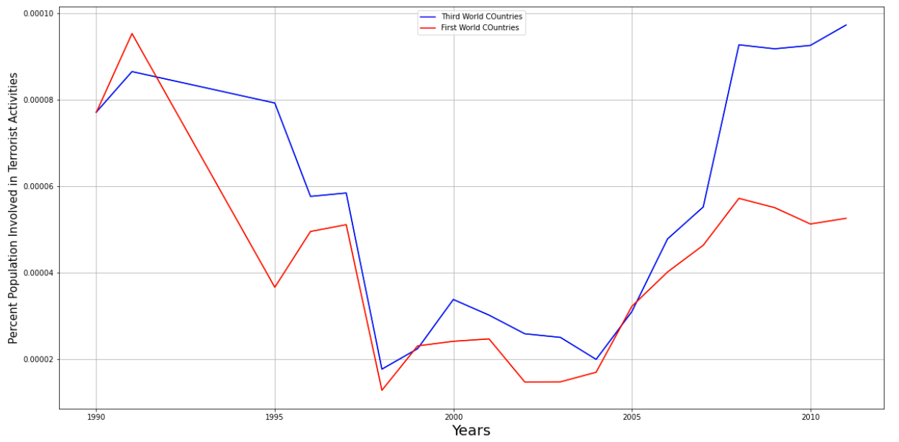

On plotting a chart for the above mentioned hypothesis we find that terrorist activities in third world countries is more as compared to first world countries even when population parameter is considered. Hence, hypothesis stands True.

2)	We expect that people holding Nonimmigrant visa's or temporary visas attack Government officials in all countries

We chose this hypothesis assuming that people who enter a country on temporary visas and have an intention to harm the country mostly will target government officials to cause unstability and turmoil in the country.
      
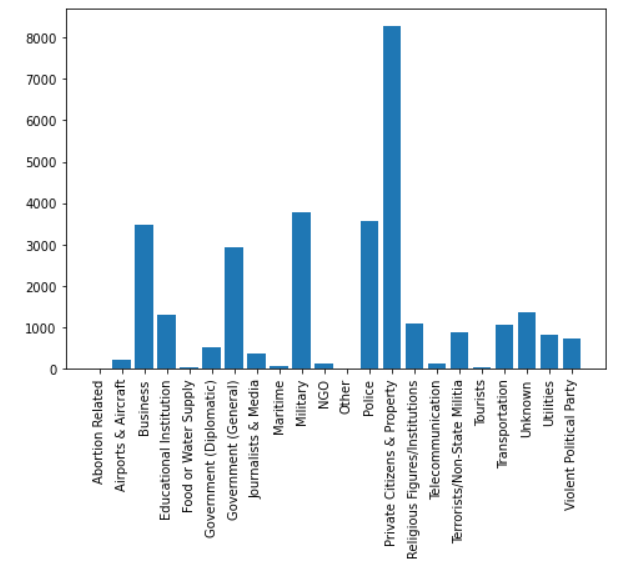

Here we find that people with Nonimmigrant or temporary visa's attack more on Private property and citizens as compared to Government officials. Hence, our hypothesis stands False.
However, to ensure that the population does not cause any form of bias here, we decided to choose a few countries and check what kind of people are targetted in them by Nonimmigrant visa holders.
We chose the below mentioned countries,

In United Kingdom, Private citizens were targetted more as compared to others.

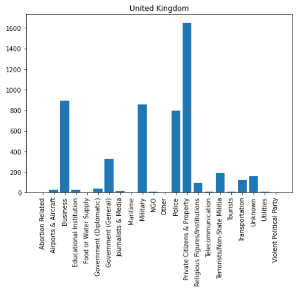

In France, businesses were targetted mroe as compared to others.

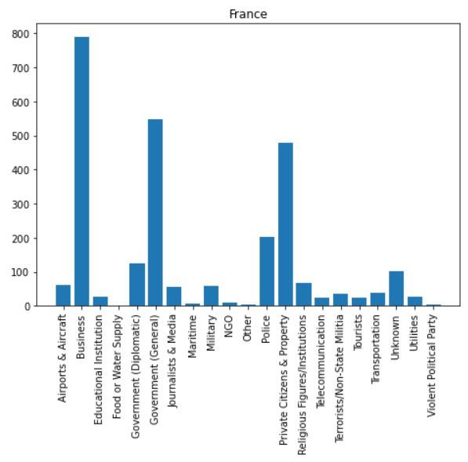

In Pakistan, Private citizens were targetted more as compared to others.

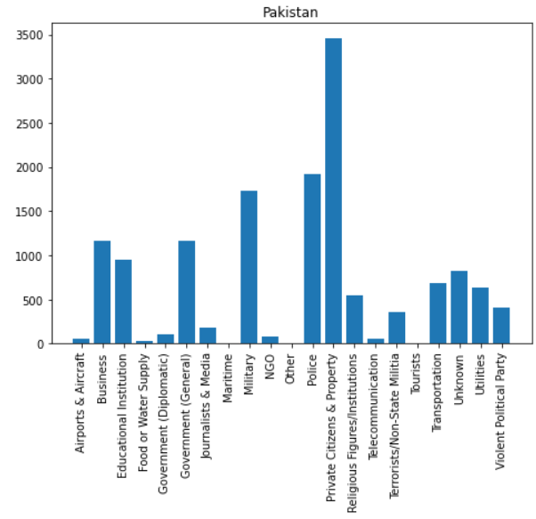

In Bangladesh, Private citizens were targetted more as compared to others.

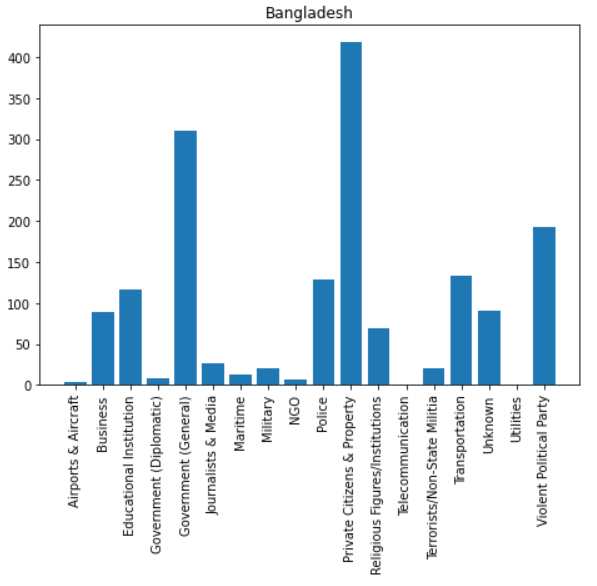

3)	Unmarried people of ages between 20-30 are more likely to commit terrorist activities as compared to people not categorized in the above criteria.

We chose this hypothesis because young people posses the energy to commit such acts. Also, people with no responsibilities are easily influenced to cary out such activities as compared to people who have family responsibilities.

Hence, from the above chart we find that out hypothesis stands False, and we see that people in the age group of 30-40 commit more acts of terrorism.

However, to not make population a factor of bias here as well, we decided to find country wise data for the above mentioned hypothesis and plot them below.

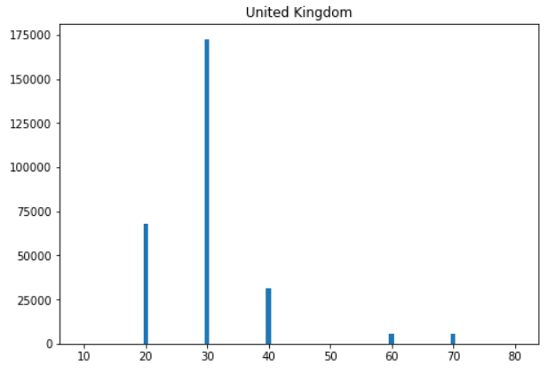

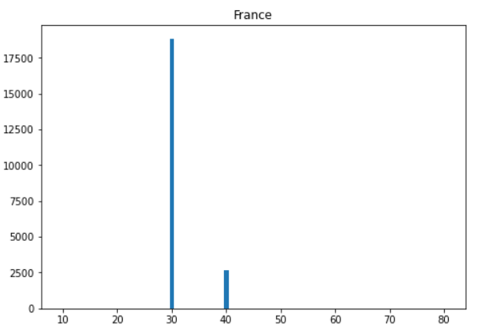

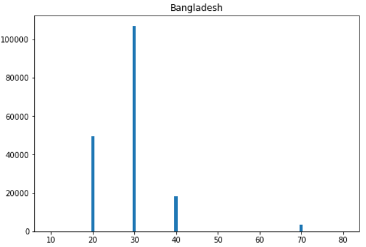

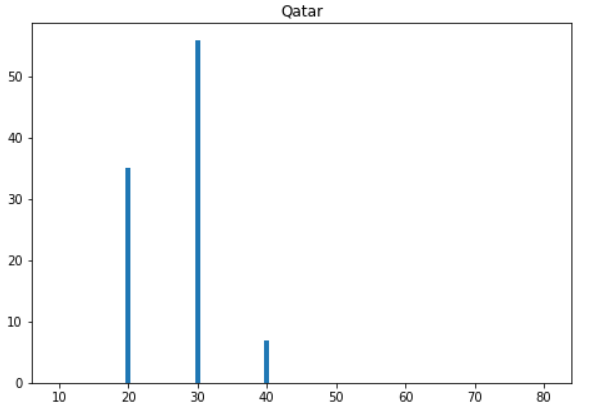

In all the above countries the most number of terrorist attacks were done by people in the 30-40 age group as well, hence, our hypothesis stands false here as well.

# Further Analysis

To further analyse the dataset which we have, we decided to find the regions where most of the terrorist activities are committed around the world.

We plotted them below and found that, South Asian region is where more terrorist activities are committed.

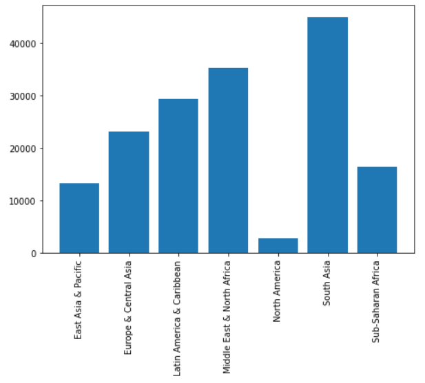

To check what kind of attacks are conducted in different regions, we checked all the regions for few types of attacks which are plotted below,

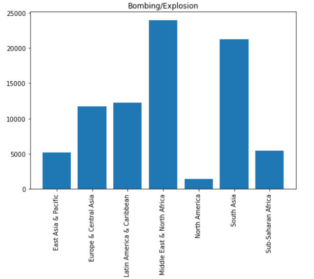

We see that most bombings have occurred in Middle east and North African region.

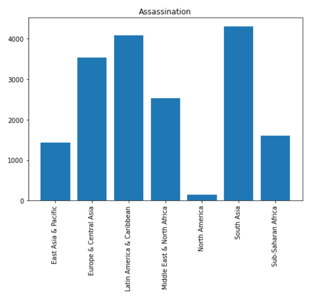

We see that most Assassinations have taken place in South Asian region.

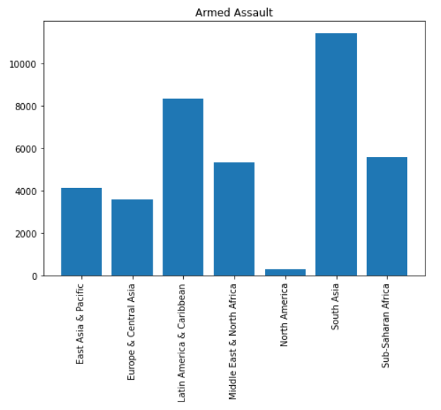

We see that most Armed Assaults have taken place in South Asian region as well. 

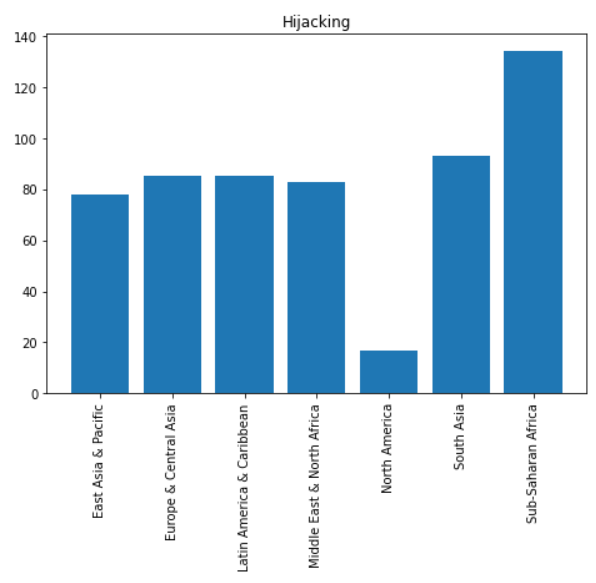

We see that most Hijackings have taken place in Sub-Saharan African region as well. 

We see that population in the Asian countries may be more due to which an increased terrorist activities can be seen there. However, since there are more number of people in Asian countries, more number of terrorist activities are bound to happen there.

Hence, we have successfully tested three hypothesis, two of which stood false and one stood true.

We also further analyzed the data to find types of attacks carried out throughout the world in different regions.
