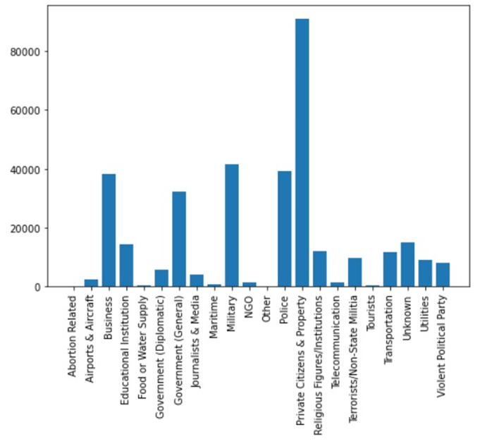

# 2021_Spring_finals

# Final Project - IS 597PR
# Terrorism in the world throughout the years

Overview: 
Terrorism is a disease which has been stuck with us forever. Our project aims to analyse terrorist activities which have been carried out throughout the world since 1970 till 2017. 
We plan to do this by analysing the datasets which will give us a deep insight into how and where the terrorist activities were carried out through these years. We decided to come up with hypothesis centered around population, income, citizenship status, type of people that were targeted and age group of terrorists. 
The data that we worked on is open source data found on Kaggle published by the University of Maryland (https://www.kaggle.com/START-UMD/gtd ). 

Other data is taken from the below websites:

Income: https://datahelpdesk.worldbank.org/knowledgebase/articles/906519

Population file: https://www.kaggle.com/gemartin/world-bank-data-1960-to-2016

Our analysis would be beneficial for people to understand which countries are safer and individuals who want to analyse this topic further.

Team Members

Bhairavi Jadhav- bjadhav2@illinois.edu
Sarthak Bhingarde- sbhing2@illinois.edu

Datasets used for Analysis

Terrorism, terrorists and perpetrators data: (https://www.kaggle.com/START-UMD/gtd ). 

Income: https://datahelpdesk.worldbank.org/knowledgebase/articles/906519

Population file: https://www.kaggle.com/gemartin/world-bank-data-1960-to-2016

We have filtered the required columns for analysis after loading the data in python.

The hypothesis we are taking under consideration are:

1)	We expect to see a decrease in terrorist activities in first world countries(USA, UK, France) as compared to third world countries(Pakistan, Bangladesh, India) due to advancement in technology since 1970s.

Conclusion : The graph generated indicates that the rate of terrorism in first world countries is more as compared to the rate of terrorism in third world countries. Hence our hypothesis stands false.

2)	Attackers who assassinated government officials were holding non-immigrant visas.

In Mexico, Permanent residents and people with unknown visa status have made the most amount of attacks on government officials.

The attacks on Government officials in France were made by people who hold non-immigrant visas.

Jordan has the most amount of attacks on Government officials made by naturalised citizens.

Conclusion: The most number of attacks on government officials all over the world were made by naturalised citizens.

To analyse this further, we checked which group non-immigrants targeted the most.

The most number of attacks by non immigrants were made on private citizens and property.

3)	Unmarried people of ages between 20-30 are more likely to commit terrorist activities as compared to people not categorized in the above criteria.

The country-wise distribution is as follows:

In all the above countries the most number of attacks were done by terrorists in the 30-40 age group.

Conclusion : The graph generated indicates that a larger proportion of individuals who are arrested belong in the age group of 30- 40. Hence our hypothesis does not stand true.

We can further analyse this dataset to see what kind of weapons were used to carry out acts of terrorism or what are the most common types of attacks in different countries and whether the perpetrators were charged or not.
